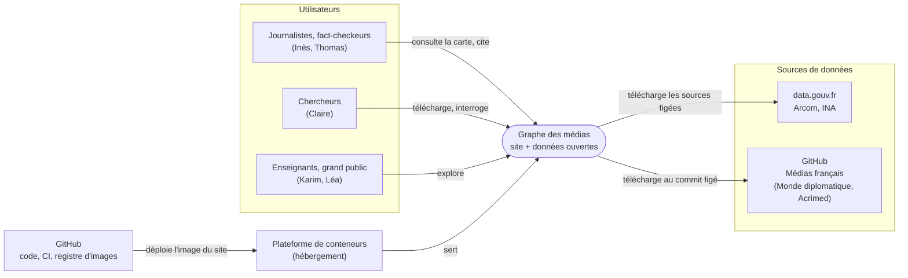
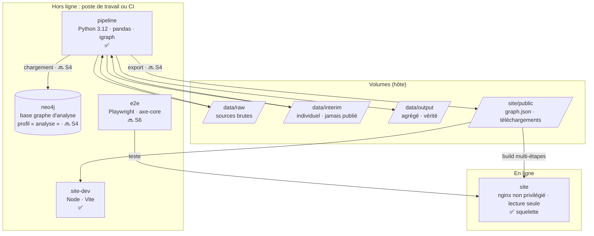
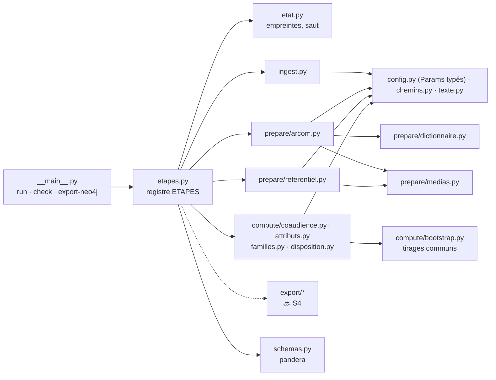
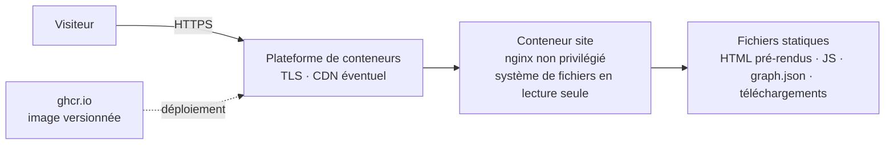

# Dossier d'architecture technique (DAT)

| | |
|---|---|
| **Projet** | Graphe des médias français |
| **Version du document** | 0.5 — fin du sprint 5 |
| **Date** | 8 octobre 2026 |
| **Auteur** | Alexandre Masson |
| **Statut** | En construction : complété à chaque sprint |

Ce dossier décrit l'architecture technique du produit : ses composants, ses données, son infrastructure, sa sécurité et son exploitation. Il distingue ce qui est **implémenté** de ce qui est **prévu**.

**Légende :** ✅ implémenté · 🟡 partiellement implémenté · 🔜 prévu (sprint indiqué)

---

## Sommaire

1. Introduction
2. Exigences qui structurent l'architecture
3. Principes d'architecture
4. Vue de contexte
5. Vue des conteneurs
6. Vue des composants du pipeline
7. Vue des données
8. Vue de l'infrastructure et du déploiement
9. Sécurité et protection des données
10. Qualité, tests et observabilité
11. Exploitation et maintenance
12. Décisions d'architecture
13. Risques et dette technique
14. État d'implémentation
15. Glossaire

---

## 1. Introduction

### 1.1 Objet

Le produit est une base de données orientée graphe et une carte interactive des médias français. Deux médias y sont reliés quand ils partagent leur public, appartiennent aux mêmes propriétaires, ou (pour les JT) traitent les mêmes sujets.

### 1.2 Périmètre du document

| Inclus | Exclu |
|---|---|
| Pipeline de données, site web, base graphe d'analyse, infrastructure Docker, CI/CD, hébergement | Méthode statistique détaillée (page Méthode, sprint 7), contenu éditorial, recherche utilisateur |

### 1.3 Documents de référence

| Document | Rôle |
|---|---|
| Note de cadrage | Objectifs, périmètre, planning |
| Cahier des charges fonctionnel (CdCF) | Exigences `EF-*`, règles `RG-*`, exigences non fonctionnelles `ENF-*` |
| Cahier des charges technique (CdCT) | Choix techniques détaillés ; ce DAT en est la version vivante |
| Backlog d'implémentation | Tâches `T-nnn` |
| [Walkthrough](walkthrough.md) | Visite guidée du code existant |
| [ADR](decisions/) | Décisions d'architecture |

Les documents de conception sont dans le dossier parent `Data Viz/`.

---

## 2. Exigences qui structurent l'architecture

| Exigence | Source | Conséquence architecturale |
|---|---|---|
| Aucune donnée individuelle publiée | FC3, ENF-09 | Séparation stricte `interim` (individuel) / `output` (agrégé) ; données hors des images Docker |
| Chaque chiffre vérifiable (source, effectif, marge) | FC1, RG-08 | Paramètres publiés ; marges calculées dans le pipeline ; métadonnées dans l'export |
| Résultats reproductibles | ENF-12 | Sources figées par empreinte, graines fixes, dépendances verrouillées, images figées |
| Carte affichée en < 3 s, données < 2 Mo | ENF-01, ENF-02 | Tout est précalculé ; site statique ; export JSON compact |
| Hébergement gratuit ou très peu cher | Contrainte budget | Pas de serveur applicatif ni de base en production |
| Tout le projet conteneurisé | Contrainte projet | Docker + Compose pour chaque composant ([ADR-001](decisions/ADR-001-conteneurisation.md)) |
| Neutralité des formulations | FC2, RG-20 à RG-25 | Textes centralisés et contrôlés automatiquement (sprint 3) |
| Accessibilité (RGAA, daltonisme, vue tableau) | ENF-06 à ENF-08 | Composants HTML natifs, vue alternative au graphe WebGL |

---

## 3. Principes d'architecture

| # | Principe | Statut |
|---|---|---|
| A1 | **Tout est calculé à l'avance** : liens, familles, disposition de la carte. Le site ne fait aucun calcul statistique. | ✅ liens, attributs, familles, disposition |
| A2 | **Site statique** servi par nginx ; pas de serveur applicatif ni de base en production. | ✅ carte en place ; fiche, recherche S6 |
| A3 | **Une seule source de vérité** : les fichiers Parquet de `data/output/`. Tout le reste en dérive. | ✅ |
| A4 | **Reproductible de bout en bout** : une commande régénère tout depuis les sources brutes. | ✅ |
| A5 | **Aucune donnée individuelle hors du pipeline.** | ✅ |
| A6 | **Paramètres explicites**, versionnés et publiés. | ✅ |
| A7 | **Tout est conteneurisé.** | ✅ pipeline et site |

---

## 4. Vue de contexte

Qui utilise le système et avec quels systèmes externes il échange.

---

## 5. Vue des conteneurs

Les unités déployables ou exécutables, toutes orchestrées par `compose.yaml`.

| Conteneur | Image | Rôle | Statut |
|---|---|---|---|
| `pipeline` | `docker/pipeline.Dockerfile` (python:3.12-slim + uv) | Téléchargement, préparation, calculs, exports, tests Python | ✅ |
| `site-dev` | `docker/site.Dockerfile`, cible `dev` (node:24-slim) | Serveur de développement Vite, Vitest, ESLint, Prettier | ✅ |
| `site` | `docker/site.Dockerfile`, cible `runtime` (nginx-unprivileged alpine-slim) | Site de production | ✅ carte (fiche, recherche S6) |
| `e2e` | image Playwright officielle | Tests de bout en bout, accessibilité, performance | 🔜 S6 |
| `neo4j` | `neo4j:5-community` (5.26, figée par empreinte), profil `analyse` | Requêtes Cypher pour l'analyse et les chercheurs | ✅ S4 |

---

## 6. Vue des composants du pipeline

### 6.1 Organisation

### 6.2 Contrat d'une étape

Chaque étape est un module qui expose :

| Fonction | Rôle |
|---|---|
| `executer(chemins)` | Effectue le traitement |
| `entrees(chemins)` | Liste les fichiers lus (configuration et données) |
| `sorties(chemins)` | Liste les fichiers écrits |

Le registre `ETAPES` (dans `etapes.py`) fixe l'ordre et associe à chaque étape les schémas pandera de ses sorties.

**Exécution d'une étape :**
1. calcul de l'empreinte = sha256 des fichiers d'entrée **+ code source du module** ;
2. si l'empreinte est celle mémorisée dans `data/.etat_pipeline.json` et que les sorties existent : étape sautée ;
3. sinon : `executer()`, puis validation des sorties par leurs schémas, puis mémorisation de l'empreinte.

Une entrée manquante arrête le pipeline avec un message explicite (code de sortie 1).

### 6.3 Étapes

| Étape | Module | Entrées | Sorties | Statut |
|---|---|---|---|---|
| `ingest` | `ingest.py` | `config/sources.yaml` | `data/raw/**`, `manifest.json` | ✅ |
| `prepare_arcom` | `prepare/arcom.py` | base et dictionnaire Arcom, `variables_arcom.yaml`, `medias.csv` | `repondant_media.parquet`, `repondant_confiance.parquet`, `repondant_profil.parquet`, `correspondance_confiance.csv` | ✅ |
| `referentiel` | `prepare/referentiel.py` | `medias.csv`, `params.yaml`, `repondant_media.parquet` | `medias.parquet` | ✅ |
| `coaudience` | `compute/coaudience.py` | `repondant_media.parquet`, `medias.parquet`, `params.yaml` | `paires.parquet` (interim), `liens.parquet`, `journal_coaudience.json` | ✅ |
| `attributs` | `compute/attributs.py` | `repondant_media`, `repondant_profil`, `repondant_confiance`, `medias.parquet`, `params.yaml` | `attributs_medias.parquet` | ✅ |
| `familles` | `compute/familles.py` | `repondant_media`, `medias.parquet`, `liens.parquet`, `params.yaml` | `familles.parquet`, `journal_familles.json` | ✅ S3 |
| `disposition` | `compute/disposition.py` | `medias.parquet`, `liens.parquet` (liens affichés), `params.yaml` | `disposition.parquet` | ✅ S3 |
| `proprietes` | `prepare/proprietes.py` | base Médias français, `proprietes_corrections.csv`, `medias.parquet` | `proprietes.parquet`, `journal_proprietes.json` | ✅ S4 |
| `jt` | `prepare/jt.py` | CSV INA | `jt_profils.parquet`, `interim/jt_quotidien.parquet` | ✅ S5 |
| `jt_similarites` | `compute/jt.py` | `jt_profils`, `jt_quotidien`, `params.yaml` | `jt_similarites.parquet` | ✅ S5 |
| `export_site` | `export/site_json.py` | sorties agrégées, `site/src/graph/schema.json` | `site/public/data/graph.json` (validé) | ✅ S4 |
| `telechargements` | `export/telechargements.py` | sorties agrégées | `site/public/telechargements/*` (CSV, Parquet, GEXF, dictionnaire) | ✅ S4 |
| `journal` | `export/journal.py` | journaux des étapes, manifeste | `run_log.json`, `telechargements/journal.json` | ✅ S4 |

### 6.4 Ligne de commande

| Commande | Effet | Statut |
|---|---|---|
| `python -m pipeline run` | Toutes les étapes, en sautant celles qui sont à jour | ✅ |
| `run --only <étape>` / `--from <étape>` / `--force` | Exécution ciblée ou forcée | ✅ |
| `python -m pipeline check` | Valide les sorties existantes | ✅ |
| `python -m pipeline export-neo4j [--verifier]` | Charge le graphe dans Neo4j ; exécute les requêtes d'exemple | ✅ S4 (`make neo4j`) |

---

## 7. Vue des données

### 7.1 Sources

| Source | Producteur | Format | Licence | Figée par | Usage | Statut |
|---|---|---|---|---|---|---|
| Baromètre « Les Français et l'information » 2026 | Arcom | CSV `;`, décimales `,` | Licence Ouverte v2.0 | sha256 | Publics, confiance, profils | ✅ |
| Dictionnaire des variables | Arcom | XLSX | Licence Ouverte v2.0 | sha256 | Libellés, correspondances | ✅ |
| Sujets des JT 2000-2020 | INA | CSV latin-1 sans en-tête | Licence Ouverte v1.0 | sha256 | Module JT | ✅ téléchargé · 🔜 traité S5 |
| Temps de parole F/H (CSA) | INA / CSA | CSV | Licence Ouverte v1.0 | sha256 | Éditeurs et groupes | ✅ téléchargé · 🔜 traité S4 |
| Médias français | Le Monde diplomatique / Acrimed | 7 TSV | ODC-By v1.0 | commit + sha256 | Propriété | ✅ téléchargé · 🔜 traité S4 |

### 7.2 Classification des données

| Zone | Contenu | Sensibilité | Versionné | Dans une image | Publié |
|---|---|---|---|---|---|
| `data/raw/` | Sources brutes | Publique (données ouvertes), mais individuelle pour l'Arcom | Non | Non | Non |
| `data/interim/` | Répondant × média, confiance individuelle | **Individuelle** (anonymisée par l'Arcom) | Non | Non | **Jamais** |
| `data/output/` | Agrégats par média, par paire | Agrégée, au-dessus des seuils | Non (régénérable) | Non | Via exports |
| `site/public/` | `graph.json`, téléchargements | Agrégée | Oui | Oui (image `site`) | Oui |

### 7.3 Tables produites

| Table | Clé | Colonnes | Statut |
|---|---|---|---|
| `interim/repondant_media` | `resp_id` | `poids`, une colonne `int8` 0/1 par média (99) | ✅ |
| `interim/repondant_confiance` | (`resp_id`, `media_id`) | `niveau` (1 référence, 2 complémentaire, 3 précaution) | ✅ |
| `interim/repondant_profil` | `resp_id` | `age_classe` (1-6), `pol` (0-10, vide si non-réponse) | ✅ S2 |
| `interim/paires` | (`source`, `cible`) | toutes les paires de médias affichables, y compris sous les seuils : **jamais publiée** | ✅ S2 |
| `output/medias` | `media_id` | `nom`, `type`, `public_prive`, `generique`, `variantes`, `libelles_arcom`, `same_brand_as`, `n_repondants`, `part_ponderee`, `affichable`, `fragile` | ✅ |
| `output/correspondance_confiance` (CSV) | `colonne` | `libelle_arcom`, `media_id`, `statut` | ✅ |
| `output/liens` | (`source`, `cible`), `source < cible` | `lift`, `lift_bas`, `lift_haut`, `n_communs`, `affiche` (ADR-005) | ✅ S2-S3 |
| `output/familles` | `media_id` | `famille`, `stabilite`, `intermediarite`, `participation`, `pont` | ✅ S3 |
| `output/disposition` | `media_id` | `x`, `y` dans [0, 1] | ✅ S3 |
| `output/journal_familles` (JSON) | — | réglages, tailles, ARI moyen, part stable, `familles_affichees` (RG-07) | ✅ S3 |
| `output/attributs_medias` | `media_id` | `n_repondants`, `pol_n`, `pol_moy`/`_bas`/`_haut`, `pol_part_nr`, `age_moy`/`_bas`/`_haut`, `moins35`/`_bas`/`_haut`, `n_confiance`, `conf_ref`/`_bas`/`_haut`, `n_conf_gauche`, `n_conf_droite`, `conf_ecart_gd`/`_bas`/`_haut`, `fragile` | ✅ S2 |
| `output/journal_coaudience` (JSON) | — | paires testées, gardées, rejetées par motif ; lift de référence | ✅ S2 |
| `output/proprietes` | (`media_id`, `proprietaire_id`) | `groupe`, `proprietaire`, `type_proprietaire`, `part` effective, `statut`, `source`, `date` | ✅ S4 |
| `output/run_log` (JSON) | — | journal complet d'une exécution (EF-FT-10) | ✅ S4 |
| `output/jt_profils` | (`chaine`, `annee`, `rubrique`) | `n_sujets`, `duree_s`, `part_sujets`, `part_duree` | ✅ S5 |
| `output/jt_similarites` | (`chaine_a`, `chaine_b`, `periode`, `mesure`) | `similarite_js`, `synchronisation` | ✅ S5 |

### 7.4 Référentiel des médias

`config/medias.csv` est la table de référence, maintenue à la main :

| Colonne | Contenu |
|---|---|
| `media_id` | Identifiant stable (ex. `france-inter`) |
| `type` | `radio`, `journal`, `magazine`, `tv`, `info`, `web`, `createur`, `jt` |
| `public_prive` | `public` (service public français), `prive`, `autre`, `na` |
| `generique` | Catégorie non affichable (« Une radio locale »…) |
| `variantes` | Autres noms, pour la recherche et le rapprochement des sources |
| `libelles_arcom` | Libellés exacts du dictionnaire Arcom, pour le contrôle des codes |
| `same_brand_as` | Même marque sur un autre support (RG-31), réciproque |

99 médias en 2026, dont 19 catégories génériques et 11 médias cités par personne (C8, Canal+, radios musicales).

### 7.5 Garde-fous sur les données

| Garde-fou | Où |
|---|---|
| Empreinte sha256 de chaque source | `ingest` |
| Libellé du dictionnaire = libellé attendu pour chaque code | `prepare_arcom` |
| Question sans réponse pour une partie de la base : arrêt, sauf choix explicite (`absence_vaut_non`) | `prepare_arcom` |
| Identifiants uniques, poids strictement positifs | `prepare_arcom` |
| Chaque colonne de confiance rattachée, forcée ou ignorée ; ambiguïté = erreur | `prepare_arcom` |
| Référentiel : identifiants uniques, valeurs autorisées, `same_brand_as` réciproque | `prepare/medias.py` |
| Schémas pandera des sorties | après chaque étape, `check` |

### 7.6 Format d'échange avec le site (✅ S4, gelé au jalon J3)

`site/public/data/graph.json`, format 1, gelé ([ADR-009](decisions/ADR-009-propriete-et-exports.md)). Structure : `meta`, `nodes`, `others` (médias sous le seuil), `edges`, `communities`, `owners`, `jt`. Schéma JSON dans `site/src/graph/schema.json`, monté en lecture seule dans le conteneur `pipeline` et validé à chaque export. 155 ko (29 ko compressé) pour un budget de 2 Mo. Détail des clés : [donnees.md § 6](donnees.md).

---

## 8. Vue de l'infrastructure et du déploiement

### 8.1 Images Docker

| Image | Base (figée par empreinte) | Taille | Utilisateur | Statut |
|---|---|---|---|---|
| `pipeline` | `python:3.12-slim@sha256:05cda977…` + `uv:0.8@sha256:1d31be55…` | ≈ 795 Mo (budget 1 Go) | `app` (uid 1000) | ✅ |
| `site-dev` | `node:24-slim@sha256:d6aa754f…` | ≈ 375 Mo décompressée (développement) | `node` (uid 1000) | ✅ |
| `site` | `node:24-slim` (build) → `nginx-unprivileged:stable-alpine-slim@sha256:3af0c10d…` (runtime) | **≈ 9 Mo** (budget 50 Mo) | `nginx` (uid 101) | ✅ |
| `e2e` | `mcr.microsoft.com/playwright` | — | — | 🔜 S6 |
| `neo4j` | `neo4j:5-community@sha256:c7d25c0e…` | 345 Mo | image officielle | ✅ S4 |

**Construction de l'image `pipeline` :**
1. copie de `pyproject.toml`, `uv.lock`, `README.md`, puis `uv sync --frozen --no-install-project` (couche de dépendances, mise en cache) ;
2. copie du code et des tests, `uv sync --frozen` ;
3. création de l'utilisateur `app`.

Le cache de uv est monté pendant le build (`--mount=type=cache`) et n'entre pas dans l'image.

### 8.2 Volumes du service `pipeline`

| Hôte | Conteneur | Mode | Rôle |
|---|---|---|---|
| `./config` | `/app/config` | lecture seule | Configuration |
| `./data` | `/app/data` | lecture-écriture | Données brutes, intermédiaires, sorties |
| `./site/public` | `/app/site/public` | lecture-écriture | Exports pour le site |
| `./pipeline`, `./tests` | `/app/pipeline`, `/app/tests` | lecture seule | Code monté en développement : pas de rebuild à chaque modification |

### 8.3 Environnements

| Environnement | Composition | Statut |
|---|---|---|
| Local | `docker compose` sur Docker Desktop (macOS arm64) | ✅ |
| CI | GitHub Actions, `ubuntu-latest` (amd64) | ✅ |
| Aperçu | Image `site` de chaque pull request : révision étiquetée `pr-<n>` du service Cloud Run `graphe-medias-apercu` (`europe-west9`), URL publiée dans la PR | 🟡 workflow `preview.yml` prêt, accès Google Cloud à créer ([deploiement.md](deploiement.md)) |
| Production | Image `site` sur Google Cloud Run, service `graphe-medias` ([ADR-010](decisions/ADR-010-hebergement-cloud-run.md)) | 🔜 S8 |

### 8.4 Chaîne CI/CD

| Workflow | Déclencheur | Étapes | Statut |
|---|---|---|---|
| `ci.yml` | pull request, push sur `main` | **dockerfiles** : hadolint · **pipeline** : image → taille → Trivy → lint → tests unitaires → pipeline complet → tests sur les données → `check` · **site** : image `dev` → Vitest, lint, build → vocabulaire → image `runtime` → Trivy → taille < 50 Mo → healthcheck, en-têtes, 404 | ✅ verte depuis le 08/10/2026 |
| `pipeline.yml` | manuel | pipeline complet → tests sur les données → `check` → pull request automatique de `site/public` | ✅ S4 (non encore lancé) |
| `reproducibility.yml` | hebdomadaire (lundi) | deux exécutions forcées, mêmes sha256 ; sorties versionnées = sorties régénérées | ✅ S4 (non encore lancé) |
| `preview.yml` | pull request | Workload Identity Federation → image `site` → Artifact Registry → révision Cloud Run étiquetée `pr-<n>`, sans trafic → vérification (CSP, lien direct, < 3 s) → URL en commentaire ; étiquette retirée à la fermeture | 🟡 S5, inactif sans accès Google Cloud |
| `deploy.yml` | étiquette de version | images multi-architecture → ghcr.io → déploiement | 🔜 S8 |

### 8.5 Architecture de production cible (🔜 S8)

---

## 9. Sécurité et protection des données

| Sujet | Mesure | Statut |
|---|---|---|
| Données individuelles | Restent dans `data/interim/`, ignoré par git et exclu des images ; seuls des agrégats au-dessus des seuils sont exportés ; un effectif n'est publié qu'avec son indicateur ; `test_no_individual_data.py` contrôle tout `site/public` | ✅ |
| Intégrité des sources | Empreinte sha256 de chaque fichier, adresses figées | ✅ |
| Chaîne d'approvisionnement | Images de base et outils de CI (hadolint, Trivy) figés par empreinte ; dépendances verrouillées (`uv.lock`, `package-lock.json`) ; Trivy en CI, échec sur faille critique corrigeable | ✅ |
| Moindre privilège | Conteneurs non root ; montages de configuration et de code en lecture seule | ✅ |
| Secrets | Aucun dans les images ni dans git ; `.env` local à partir de `.env.example` (mot de passe Neo4j) | ✅ |
| Site | CSP sans source externe ni script en ligne, `nosniff`, `Referrer-Policy`, `Permissions-Policy`, `X-Frame-Options` ; nginx non root, système de fichiers en lecture seule, `cap_drop: ALL` ; journaux sans adresse IP complète ; HTTPS terminé par la plateforme | ✅ image · HTTPS 🔜 S8 |
| Traçage des visiteurs | Aucun script tiers ; mesure d'audience éventuelle exemptée de consentement | 🔜 S8 |
| Licences | Attribution des sources dans `LICENSE-DATA.md`, l'interface et les exports | 🟡 fichier en place |

---

## 10. Qualité, tests et observabilité

### 10.1 Tests

| Niveau | Outil | Contenu actuel | Statut |
|---|---|---|---|
| Unitaires | pytest | 68 tests ; S4 : chaînes de détention et parts effectives, cycles, groupe principal, corrections, schéma de `graph.json` (5 cas refusés), dictionnaire complet, GEXF à date fixe, requêtes Cypher | ✅ |
| Données réelles | pytest (marqueur `data`) | 26 tests ; S4 : `test_no_individual_data.py` (ENF-09 sur tout `site/public`), données Neo4j sans NaN | ✅ |
| Reproductibilité | `make reproductibilite` | Deux exécutions forcées : 26 fichiers identiques | ✅ S4 |
| Neo4j | `make neo4j` | Chargement puis 6 requêtes d'exemple non vides | ✅ S4 (local) |
| Module JT | pytest (`test_donnees_jt.py`) | Parts et similarités identiques aux valeurs de la maquette (5 périodes × 2 mesures) | ✅ S5 |
| Rendu réel | Playwright (image officielle, vérification ponctuelle) | Carte affichée en 0,74 s, lien direct, historique, mode sans familles, aucune violation de CSP | ✅ S5 (manuel ; automatisé en S6) |
| Schémas | pandera | 8 schémas (dont `liens`, `attributs_medias`, `familles`, `disposition`), appliqués après chaque étape | ✅ |
| Lint | ruff | `check` + `format --check` | ✅ |
| Front-end | Vitest, ESLint, Prettier, `tsc` | 40 tests : + `graph.json` publié validé contre `schema.json` (Ajv), contrôle de chargement, état ↔ URL, magasin (voisins, filtres), construction du graphe de la carte (avec et sans familles), échelles | ✅ |
| Vocabulaire | `npm run vocabulaire` | Formules interdites (RG-20, RG-25) dans `i18n/fr.ts`, `methode.md`, `donnees.md` | ✅ S3 |
| Dockerfiles, images | hadolint, Trivy | Lint des deux Dockerfiles ; failles critiques corrigeables | ✅ S3 |
| Bout en bout, accessibilité, performance | Playwright, axe-core, Lighthouse CI | — | 🔜 S6-S8 |

### 10.2 Journalisation

Le pipeline écrit sur la sortie d'erreur : heure, niveau, étape, puis les chiffres clés de chaque étape (nombre de répondants, médias affichables, médias absents…). `-v` active le niveau DEBUG. Un journal structuré `run_log.json` est prévu au sprint 4 (T-047).

### 10.3 Traçabilité

| Élément | Trace |
|---|---|
| Version de chaque source | `data/raw/manifest.json` (adresse, empreinte, taille, date de vérification) |
| Journal complet d'une exécution | `data/output/run_log.json`, publié dans `telechargements/journal.json` |
| Correspondance de la confiance | `data/output/correspondance_confiance.csv` |
| Filtrage des liens | `data/output/journal_coaudience.json` (paires testées, rejets par motif, lift de référence) |
| Choix des seuils, des familles ; aperçu de la carte | `docs/exploration/seuils.md`, `familles.md`, `carte.svg` (`make exploration`) |
| État des étapes | `data/.etat_pipeline.json` |
| Décisions | `docs/decisions/ADR-*.md` |

---

## 11. Exploitation et maintenance

| Opération | Procédure | Statut |
|---|---|---|
| Nouvelle édition du baromètre | Mettre à jour `sources.yaml` puis `variables_arcom.yaml` ; le contrôle des libellés signale chaque code à revoir | ✅ mécanisme en place |
| Source modifiée par son producteur | `ErreurEmpreinte` : vérifier puis mettre à jour l'empreinte | ✅ |
| Mise à jour des images de base | Mensuelle, par pull request (Dependabot ou Renovate) | 🔜 S8 |
| Mise à jour de la propriété | Annuelle au minimum, fichier de corrections sourcé | 🔜 S4 |
| Retour arrière | Redéploiement de l'image précédente (ghcr.io) | 🔜 S8 |

---

## 12. Décisions d'architecture

| ADR | Décision | Date |
|---|---|---|
| [ADR-001](decisions/ADR-001-conteneurisation.md) | Conteneurisation intégrale du projet | 08/10/2026 |
| [ADR-002](decisions/ADR-002-base-graphe-neo4j.md) | Neo4j Community plutôt que Kùzu (archivé en octobre 2025) | 08/10/2026 |
| [ADR-003](decisions/ADR-003-source-proprietes.md) | Base « Médias français » figée + fichier de corrections | 08/10/2026 |
| [ADR-004](decisions/ADR-004-base-repondants.md) | Base de 2 939 répondants ; non-interrogés téléphoniques = ne suivent pas les médias en ligne | 08/10/2026 |
| [ADR-005](decisions/ADR-005-seuils-des-liens.md) | RG-01 (50) et RG-04 (30) maintenus ; RG-05 option C : données inchangées, carte limitée à 5 voisins minimum + liens au-dessus du lift de référence | 08/10/2026 |
| [ADR-006](decisions/ADR-006-indicateurs-des-publics.md) | Âge approché par classes (65+ = 74 ans), note politique avec centre = « ST Centre », confiance = part de « source de référence » | 08/10/2026 |
| [ADR-007](decisions/ADR-007-familles.md) | Familles : Leiden sur les liens affichés, `log(lift)`, résolution 0,6 → 3 familles, 94 % stables | 08/10/2026 |
| [ADR-008](decisions/ADR-008-disposition.md) | ForceAtlas2 implémenté en numpy dans le pipeline | 08/10/2026 |
| [J2](decisions/J2-go-no-go.md) | Jalon J2 : **go sous condition** du test H5 (proposition) | 08/10/2026 |
| [ADR-009](decisions/ADR-009-propriete-et-exports.md) | Propriétaires ultimes et parts effectives ; corrections sourcées ; format `graph.json` 1 gelé (J3) ; exports ; addendum : bloc `jt` | 08/10/2026 |
| [ADR-010](decisions/ADR-010-hebergement-cloud-run.md) | Hébergement : Google Cloud Run (`europe-west9`), aperçus par étiquettes de révision, Workload Identity Federation | 08/10/2026 |

**Décisions à prendre :**

| # | Sujet | Échéance |
|---|---|---|
| J2 | Go / go partiel / stop, après le test H5 (noms des familles) | 30 octobre |

---

## 13. Risques et dette technique

| Élément | Type | Impact | Action |
|---|---|---|---|
| CI jamais exécutée | Risque | Problèmes Linux/amd64 non détectés (droits sur les volumes, architecture) | Créer le dépôt GitHub et lancer la CI |
| Images construites pour arm64 uniquement en local | Dette | Différences possibles avec la CI | Build multi-architecture prévu (`deploy.yml`, S8) |
| Base de propriété de décembre 2024, presse indépendante absente | Risque | 76 % des médias rattachés, 16 « non identifiés » | Saisies sourcées dans `proprietes_corrections.csv` (ADR-009) |
| Code monté en lecture seule en développement, mais copié dans l'image pour la CI | Choix | Deux chemins d'exécution | Les deux sont testés (local et CI) |
| Graphe très dense : 62 % des paires reliées avec RG-05 telle qu'écrite | Risque **traité** | Carte illisible | ADR-005 option C : 27 % des paires tracées |
| Résolution des familles fragile (0,6 stable à 94 %, 0,7 à 66 %) | Risque | Familles non affichées à la prochaine édition | `make exploration` à chaque édition ; RG-07 protège le site (ADR-007) |
| Âge connu par classes seulement | Limite des données | Âge moyen approché (± 1 an) | Mettre en avant la part des moins de 35 ans (ADR-006) |
| Bibliothèques front récentes (Preact 11, Sigma 4, Vite 8, TypeScript 6) | Risque **traité en S5** | Sigma 4 change un réglage par défaut (`itemSizesReference` vaut `positions`) | API lue dans les déclarations du paquet ; rendu vérifié dans un vrai navigateur |
| Projet initialement dans `Documents` (synchronisé avec iCloud Drive), disque plein à 98 % | Risque **résolu** le 08/10/2026 | macOS retirait les fichiers du disque ; Docker ne pouvait plus les lire (`Errno 35`) | Projet déplacé dans `~/dev/graphe-medias` ; contrôle `fichiers-locaux` conservé dans le Makefile |

---

## 14. État d'implémentation

| Domaine | Fin S5 | Prochaine étape |
|---|---|---|
| Socle Docker et outillage | ✅ pipeline, site-dev, site, hadolint, Trivy | Multi-architecture (S8) |
| Ingestion des sources | ✅ 12 sources | — |
| Préparation Arcom | ✅ médias, confiance, âge, politique | — |
| Calculs du graphe | ✅ co-audience, attributs, familles, disposition, ponts, module JT | — |
| Propriété | ✅ 76 % rattachés, 100 % rattachés ou marqués | Saisies sourcées (hors code) |
| Exports et base graphe | ✅ `graph.json` validé, téléchargements, journal, Neo4j | Chargement du site (S5) |
| Site | ✅ chargement validé, état ↔ URL, en-tête, bandeau, légende, pied de page, carte Sigma (familles, sélection, filtres, zoom) | Recherche, fiche complète, vue tableau (S6) |
| CI/CD | ✅ verte : hadolint, pipeline, site, Trivy | `deploy.yml` (S8) | Exécution sur GitHub |

---

## 15. Glossaire

| Terme | Définition |
|---|---|
| **ADR** | Architecture Decision Record : fiche courte qui consigne une décision et ses raisons |
| **Affichable** | Média non générique suivi par au moins 50 répondants (RG-01) |
| **CATI** | Enquête par téléphone ; ici, l'échantillon de personnes n'utilisant pas internet |
| **Co-audience** | Part de public commune à deux médias |
| **Empreinte (sha256)** | Identifiant calculé à partir du contenu d'un fichier ; change si un seul octet change |
| **Fragile** | Chiffre reposant sur moins de 100 répondants (RG-03) |
| **Lift** | Rapport entre le public commun observé et celui attendu par hasard |
| **Parquet** | Format de fichier tabulaire compressé, qui conserve les types |
| **Pondération** | Correction qui rend l'échantillon représentatif (colonne `POIDS`) |
| **uv** | Gestionnaire de paquets et d'environnements Python |
